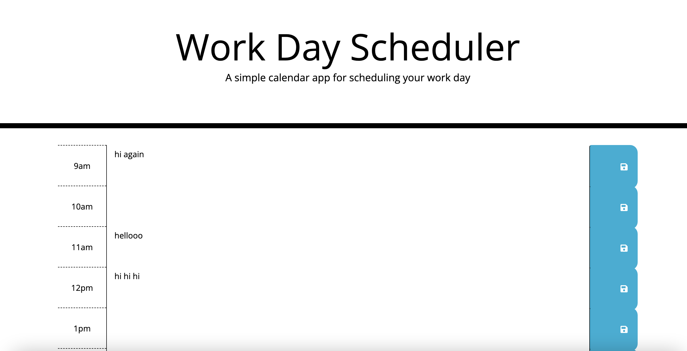

# Work Day Scheduler

## Description
This is a daily planner so that the user can manage their time effectively.

## Systems
This application was created using HTML, CSS, and JavaScript with Visual Studio Code.

## Application
The user is taken to a daily planner, and opens the planner. The current day is displayed at the top of the calendar, and time blocks for the standard work day are in order below. When the user enters an event, they click the save button on the right of the time block, and the event text is saved. When the user refreshes the page, the saved events stay on the page. 

## Webpage

The following image shows a screenshot of the application: 

You can access the GitHub repository here: https://github.com/fssaberi/work-day-scheduler.git. 

You can access the webpage here: https://fssaberi.github.io/work-day-scheduler/. 